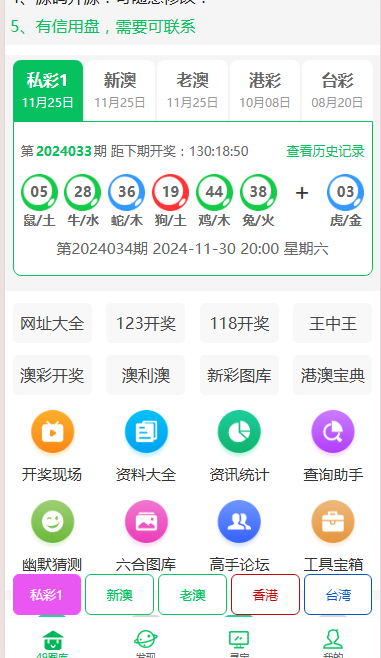
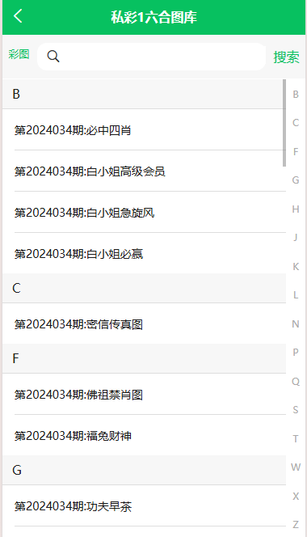
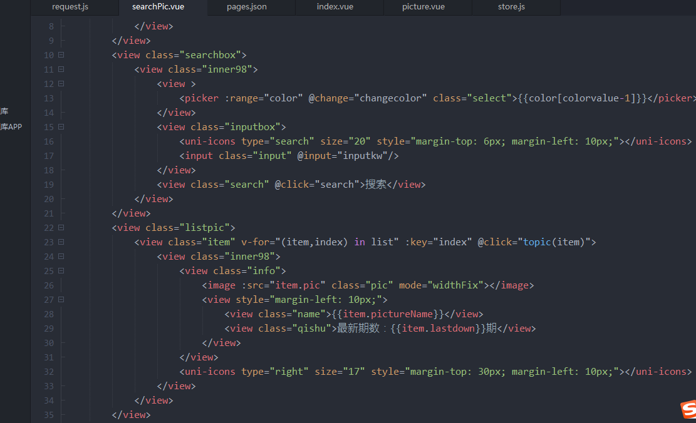
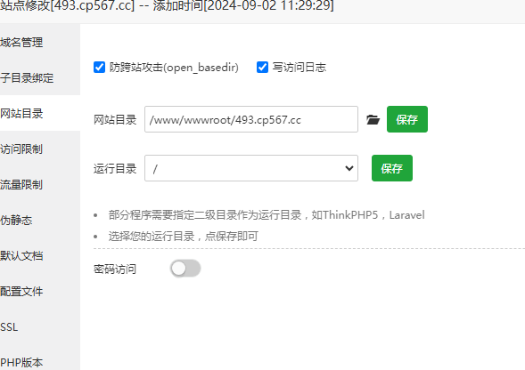

# 六合彩图库系统搭建|一条龙搭建六合彩开奖图库网站app

#### 六合彩图库搭建效果演示视频
本期搭建的六合彩图库，采用49图库源码进行搭建，前端采用hbuilderx进行打包编译，后端采用PHP；宝塔新建站点，上传源码，配置站点信息等。完整版效果演示视频如下
[video:六合彩图库搭建教程演示](./image/20241125.mp4)

#### 六合彩图库搭建文档

- [搭建六合彩图库](https://www.tuku325.cc/)，[搭建六合彩开奖网](https://www.tuku325.cc/) 联系技术 https://www.tuku325.cc

1.服务器环境，推荐宝塔部署
linux + nginx +mysql5.6 + php7.3 + redis + Supervisor

2.宝塔新建站点，
网站目录选择根目录；
运行目录选择public
伪静态选择 thinkphp
安装ssl（可选

3.在supervisor里面新建进程，目录选择根目录用于采集图片；
采集官方彩图片：php think downimg
采集幽默猜猜：php think caicai
采集综合资料：php think corpus
采集论坛：php think faxian
采集私彩图片：php think tuku325
显示私彩图片：php think tu6
发布私彩预告：php think kai
确保public目录是www用户且可写

*uni前端检查开奖组件的默认值，防止跳码*

#### 六合彩图库搭建教程截图

#### 一条龙搭建六合彩开奖图库网站app常见问题
- PHP版本要求多少，软件环境要求吗？
答：linux + nginx +mysql5.6 + php7.3 + redis + Supervisor
  

- 为什么图库不采集
答：请查看Supervisor进程采集日志，看看是否报错，如果报错，根据具体错误原因进行处理
  
- 为什么修改根目录 .env数据库配置文件无效
答：请删除PHP禁用函数putenv
  
- 前端代码可以单独部署吗？
答：可以的，前端可以单独部署；后端接口可以设置运行跨域；或者在前端进行接口转发也可以的。
  
- 一个后台可以搭建多个前端站点吗？
答：可以的；前端多个模版不影响，接口指向1个后台就可以了
